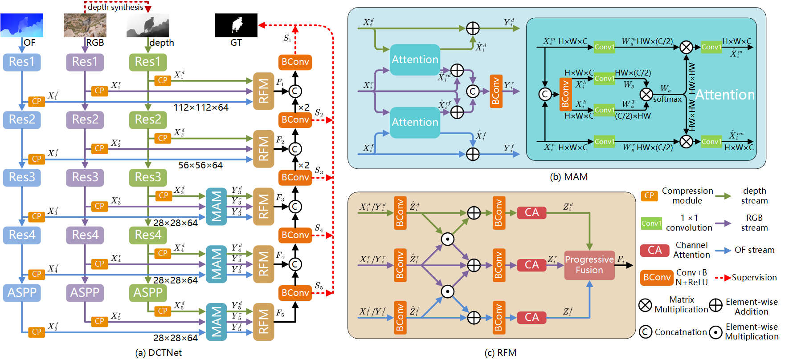
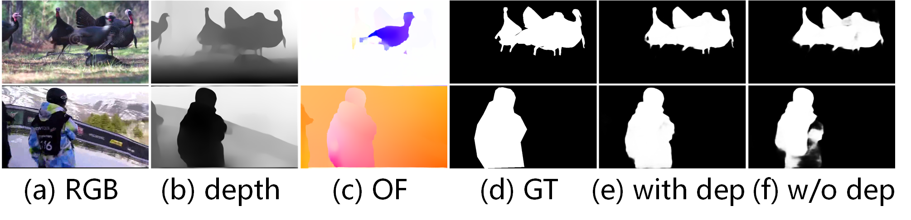

# DCTNet: Depth-Cooperated Trimodal Network for Video Salient Object Detection

This repository provides PyTorch code implementation for DCTNet: Depth-Cooperated Trimodal Network for Video Salient Object Detection [[Arxiv](https://arxiv.org/pdf/2202.06060.pdf)]

**News: The new [RDVS](https://github.com/kerenfu/RDVS) dataset,  whose depth of videos is realistic, is coming!!!**

<p align="center">
     <br />
 <em> 
     Overview of DCTNet. (a) shows the big picture. (b) and (c) show the details of MAM and RFM, respectively.
    </em>
</p>

<p align="center">
     <br />
 <em> 
     Effectiveness of leveraging depth to assist VSOD. OF denotes optical flow, and GT represents ground truth. <br />
    Column (e) and (f) are predictions from our full model (with depth) and its variant (without depth), respectively.
    </em>
</p>


## Requirements

- Python 3.7
- Pytorch 1.6.0
- Torchvision 0.7.0
- Cuda 9.2
- Ubuntu16.04

## Usage

### Training

1. Download the pre_trained ResNet34 [backbone](https://download.pytorch.org/models/resnet34-333f7ec4.pth) to './model/resnet/pre_train/'.
2. Download the train dataset (containing DAVIS16, DAVSOD, FBMS and DUTS-TR) from [Baidu Driver](https://pan.baidu.com/s/1mVtAWJS0eC690nPXav2lwg) (PSW: 7yer) and save it at './dataset/train/*'. 
3. Following instructions of [RAFT](https://github.com/princeton-vl/RAFT) to prepare the optical flow and instructions of [DPT](https://github.com/isl-org/DPT) to prepare the synthetic depth map.(Both optical flow map and synthetic depth map are also available from our dataset link)
4. Download the pre_trained RGB, depth and flow stream models from [Baidu Driver](https://pan.baidu.com/s/1HptTP81LXANJ9W0Lu3XCQA) (PSW: 8lux) to './checkpoints/'.
5. The training of entire DCTNet is implemented on two NVIDIA TiTAN X GPUs. 
   - run `CUDA_VISIBLE_DEVICES=0,1 python -m torch.distributed.launch --nproc_per_node=2 train.py` in terminal

#### (PS: For pretraining different streams)
   - The pretraining code of different streams can be derived from `train.py`. We provide `pretrain_depth.py` and it can also be modified for pretraining the other two streams.  What is more, for RGB/spatial stream, we additionally use DUTS-TR for pretraining.

### Testing

1. Download the test data (containing DAVIS16, DAVSOD, FBMS, SegTrack-V2, VOS) from [Baidu Driver](https://pan.baidu.com/s/1u1qOWkv5WbovwWKogXwZQw) (PSW: 8uh3) and save it at './dataset/test/*'

2. Download the trained model from [Baidu Driver](https://pan.baidu.com/s/1Z8Sut8bOGOwbUBf0Tmhm4w) (PSW: lze1) and modify the  `model_path` to its saving path in the `test.py`.

3. Run `python test.py` in the terminal.

   

In addition to the one reported in the paper, we also provide different versions with two more training dataset-combos, including DAVIS + FBMS, and DAVIS + DAVSOD. 

### DAVIS + FBMS 

Models with "*" are traditional methods, MGAN and FSNet are trained and fine-tuned on DAVIS and FBMS. The comparison results are below. Download the trained model from [Baidu Driver](https://pan.baidu.com/s/12h5M639V59eLLEkJ3FcMFA) (PSW: l3q2)

| Datasets    | Metrics   | MSTM* | STBP* | SFLR* | SCOM* | MGAN      | FSNet | Ours      |
| ----------- | :-------- | ----- | ----- | ----- | ----- | --------- | ----- | --------- |
| DAVIS       | maxF      | 0.395 | 0.485 | 0.698 | 0.746 | 0.893     | 0.907 | **0.912** |
|             | S-measure | 0.566 | 0.651 | 0.771 | 0.814 | 0.913     | 0.920 | **0.924** |
|             | MAE       | 0.174 | 0.105 | 0.060 | 0.055 | 0.022     | 0.020 | **0.014** |
| DAVSOD      | maxF      | 0.347 | 0.408 | 0.482 | 0.473 | 0.662     | 0.685 | **0.691** |
|             | S-measure | 0.530 | 0.563 | 0.622 | 0.603 | 0.757     | 0.773 | **0.782** |
|             | MAE       | 0.214 | 0.165 | 0.136 | 0.219 | 0.079     | 0.072 | **0.068** |
| FBMS        | maxF      | 0.500 | 0.595 | 0.660 | 0.797 | **0.909** | 0.888 | **0.909** |
|             | S-measure | 0.613 | 0.627 | 0.699 | 0.794 | 0.912     | 0.890 | **0.916** |
|             | MAE       | 0.177 | 0.152 | 0.117 | 0.079 | 0.026     | 0.041 | **0.024** |
| SegTrack-V2 | maxF      | 0.526 | 0.640 | 0.745 | 0.764 | **0.840** | 0.806 | 0.826     |
|             | S-measure | 0.643 | 0.735 | 0.804 | 0.815 | **0.895** | 0.870 | 0.887     |
|             | MAE       | 0.114 | 0.061 | 0.037 | 0.030 | 0.024     | 0.025 | 0.034     |
| VOS         | maxF      | 0.567 | 0.526 | 0.546 | 0.690 | 0.743     | 0.659 | **0.764** |
|             | S-measure | 0.657 | 0.576 | 0.624 | 0.712 | 0.807     | 0.703 | **0.831** |
|             | MAE       | 0.144 | 0.163 | 0.145 | 0.162 | 0.069     | 0.103 | **0.061** |

### DAVIS + DAVSOD 

SSAV，PCSA and TENet are trained and fine-tuned on DAVIS and DAVSOD. The comparison results are below. Download the trained model from [Baidu Driver](https://pan.baidu.com/s/12Q3W56g3_F7REiKBsMgWGg) (PSW: srwu)

| Datasets    | Metrics   | MSTM* | STBP* | SFLR* | SCOM* | SSAV  | PCSA  | TENet | Ours      |
| ----------- | :-------- | ----- | ----- | ----- | ----- | ----- | ----- | ----- | --------- |
| DAVIS       | maxF      | 0.395 | 0.485 | 0.698 | 0.746 | 0.861 | 0.880 | 0.894 | **0.904** |
|             | S-measure | 0.566 | 0.651 | 0.771 | 0.814 | 0.893 | 0.902 | 0.905 | **0.917** |
|             | MAE       | 0.174 | 0.105 | 0.060 | 0.055 | 0.028 | 0.022 | 0.021 | **0.016** |
| DAVSOD      | maxF      | 0.347 | 0.408 | 0.482 | 0.473 | 0.603 | 0.656 | 0.648 | **0.695** |
|             | S-measure | 0.530 | 0.563 | 0.622 | 0.603 | 0.724 | 0.741 | 0.753 | **0.778** |
|             | MAE       | 0.214 | 0.165 | 0.136 | 0.219 | 0.092 | 0.086 | 0.078 | **0.069** |
| FBMS        | maxF      | 0.500 | 0.595 | 0.660 | 0.797 | 0.865 | 0.837 | 0.887 | 0.883     |
|             | S-measure | 0.613 | 0.627 | 0.699 | 0.794 | 0.879 | 0.868 | 0.910 | 0.886     |
|             | MAE       | 0.177 | 0.152 | 0.117 | 0.079 | 0.040 | 0.040 | 0.027 | 0.032     |
| SegTrack-V2 | maxF      | 0.526 | 0.640 | 0.745 | 0.764 | 0.798 | 0.811 | **    | **0.839** |
|             | S-measure | 0.643 | 0.735 | 0.804 | 0.815 | 0.851 | 0.866 | **    | **0.886** |
|             | MAE       | 0.114 | 0.061 | 0.037 | 0.030 | 0.023 | 0.024 | **    | **0.014** |
| VOS         | maxF      | 0.567 | 0.526 | 0.546 | 0.690 | 0.742 | 0.747 | **    | **0.772** |
|             | S-measure | 0.657 | 0.576 | 0.624 | 0.712 | 0.819 | 0.828 | **    | **0.837** |
|             | MAE       | 0.144 | 0.163 | 0.145 | 0.162 | 0.074 | 0.065 | **    | **0.058** |


## For evaluation:

1. The saliency maps can be download from [Baidu Driver](https://pan.baidu.com/s/10i5ADy4iSSwydy04Enf27w) (PSW: wfqc)
2. Evaluation Toolbox: We use the standard evaluation toolbox from [DAVSOD benchmark](https://github.com/DengPingFan/DAVSOD).

## A new RGB-D VSOD dataset (with realistic depth, coming now):

We have constructed a new RGB-D VSOD dataset, whose depth is realistic, rather synthesized. See the links for the new [RDVS](https://github.com/kerenfu/RDVS) dataset and the [paper](https://arxiv.org/abs/2310.15482).


## Citation

Please cite our paper if you find this work useful:

```
@inproceedings{lu2022depth,
  title={Depth-Cooperated Trimodal Network for Video Salient Object Detection},
  author={Lu, Yukang and Min, Dingyao and Fu, Keren and Zhao, Qijun},
  booktitle={2022 IEEE International Conference on Image Processing (ICIP)},
  year={2022},
  organization={IEEE}
}
```

